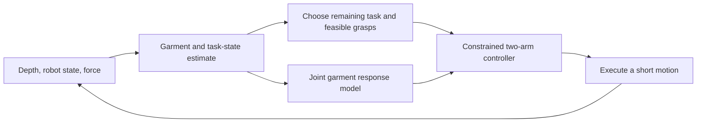

# Seated bilateral dressing: task implementation and control choice

Date: 2026-09-22. Primary-source research and read-only code inspection.
No tests, simulation, training or empirical re-analysis were run.

**Historical scope correction (2026-09-23):** the owner specified a chair with
**no backrest** and is now considering an RL task that starts with both hands
already inside the sleeves. The backrest obstruction and from-empty-sleeve
start discussed below are superseded for this candidate. See the
[current RL research design](2026-09-23-backless-bilateral-rl-training-design.md).

## Selected task and recommendation

The owner selected a person sitting in a chair with **both human arms raised
forward**, and a robot putting a garment onto both arms and the torso. This
supersedes the previous single-arm research recommendation. A successful episode
must leave the garment worn on the body, not merely register two sleeve entries.

For the first implementation, use **reactive task and motion planning with
joint garment feedback control**. Do not carry over the current from-scratch
RL training pipeline. This is a control-system recommendation, not a claim that
RL cannot solve dressing. The owner explicitly permits a non-RL method.

The initial implementation would require no learned action policy or teacher
distillation. It would require a complete scene, garment semantics, state
estimation, a task specification and a controller. Physics-model calibration
and perception remain real work; removing policy training does not remove them.

Garment type was requested asynchronously and remains unspecified. The concrete
sequence below uses a **rear-opening gown as a working example**, because it
admits front-side donning in the selected posture. This is not an owner-selected
garment. A front-opening coat and a pullover need different routes, detailed
below. No implementation or execution is launched by this document.

## What PA-BiCoop does, and what its limitation means here

[PA-BiCoop](https://arxiv.org/pdf/2606.28192), Sections III–V, learns keyframe
actions from demonstrations, including supervised primary/auxiliary role labels.
RLBench2 is its benchmark, not its training algorithm. Arm roles can switch.
The stated limitation concerns extremely long tasks or extended pauses; the
authors suggest stage prediction or lightweight memory. Its physical experiments
are handover and banana manipulation, not dressing.

The proposed dressing task is a plausible challenge for maintaining task state
across manipulation phases. It is not an already demonstrated failure of this
paper. Long elapsed time alone does not establish a long decision horizon, and
failure without garment training would not isolate a memory limitation.

Our implementation should retain facts such as which arm remains inside which
sleeve, which grasp is active, and whether the torso panel is correctly placed.
These facts must be revised from observations when they cease to hold. Merely
remembering that an insertion command was executed is insufficient. A learned
primary/auxiliary architecture could in principle encode these facts too;
its coordinate choice does not mathematically prohibit dressing.

## Direct alternatives and implementation precedents

| Primary source | What it contributes to this implementation choice |
|---|---|
| [Wearing A Coat, 2026 preprint](https://arxiv.org/html/2607.10999) | Direct two-sleeve control using whole-garment simulation, global optimization and local feedback. It already manages interference between the sleeves. Its task ends with the sleeve roots at the shoulders; its mannequin example permits compliant arm movement. The local-only ablation misses opening orientation. It is a close control baseline, not proof of fixed-pose chair-constrained torso dressing. |
| [Learning garment manipulation policies toward robot-assisted dressing, 2022](https://pubmed.ncbi.nlm.nih.gov/35385294/) and [author code](https://github.com/fan6zh/robot_dressing) | Direct rear-opening hospital-gown precedent: preparation, mobile access around a bed and sequential arm lifting/dressing on a manikin. The selected fixed forward-arm posture differs. Full garment dressing and preparation are already established research topics. |
| [GoC-MPC, 2026 preprint](https://arxiv.org/html/2603.18400) and [official code](https://github.com/corallab-base/goc-mpc) | A non-RL reference for partially ordered tasks, arm assignment, synchronization and backtracking. Includes physical tablecloth folding. Its limitations include state estimation and the supplied plan skeleton. A constraint graph or selective rollback alone is already covered. The code is public; compatibility with this repository was not tested. |
| [ReKep](https://arxiv.org/abs/2409.01652) and [official code](https://github.com/huangwl18/ReKep) | Relational keypoints and optimization provide another non-RL reference. Its long-task appendix needed manually supplied keypoints/constraints and stage-wise detection. Language-generated point constraints do not supply a verified cloth–body contact model. |
| [Interleaving prediction, planning and control for deformable objects, 2020](https://arxiv.org/abs/2001.09950) | Already combines a coarse global representation, local deformable control and deadlock prediction, with cloth/rope examples. A coarse planner plus local control is established methodology. |
| [Symbolic planning with motion primitives for dressing assistance, 2018](https://www.iri.upc-csic.es/publications/show/2045) | Demonstrates adaptive task/motion integration in shoe dressing. Neither dressing stages nor a symbolic task layer is a new contribution by itself. |
| [CDCPD2 paper](https://arm.robotics.umich.edu/download.php?p=94) and [implementation](https://github.com/UM-ARM-Lab/cdcpd) | A reference for tracking occluded deformables while maintaining geometric constraints. It does not provide complete garment semantics or certify sleeve threading from arbitrary observations. |

These sources support an implementable planning/control route. They also rule
out claiming that switching from RL to a task graph is itself an algorithmic
discovery. Generic task planning needs a garment-specific state and deformation
model to reason about this scene.

## Task contract: geometry comes before the learner

### Human and chair

Use a body frame with forward, left and up explicitly defined. Both arms extend
forward rather than sideways in a T-pose. Shoulder-height hands and slightly
bent elbows are a nominal implementation assumption, not angles supplied by the
owner. Seat placement, arm elevation and elbow bend should be parameters.

The first simulated recipient can maintain that pose. The planner must not
silently command the human's joints to make its own plan feasible. Real sensor
updates must still detect deviations from the assumed posture.

Represent the whole relevant body, including hands, both arms, shoulders, neck,
torso and lap. Register the chair seat, back and armrests as physical obstacles.
Cloth–body, cloth–chair and cloth self-contact matter. Robot collision constraints
also need the full links, not just two end-effector points.

### Garment-dependent routes

| Garment | Required route and consequence |
|---|---|
| Rear-opening gown | Sleeve entrances can be presented from the front, followed by shoulder placement and draping the front panel over the torso. Coverage targets must acknowledge the intended rear opening. Back fastening, if required, is an additional operation. |
| Front-opening coat/shirt | The back panel must reach the back of the torso, while sleeves and front panels retain the correct orientation. Chair geometry and access behind the shoulders become central. A back pressed against an impenetrable chair with no available gap cannot be dressed by commanding cloth through that interface. |
| Pullover T-shirt/sweatshirt | Neck/hem passage around the head and subsequent torso descent are additional requirements. Dressing both sleeves alone does not put the pullover on. A narrow neck opening or inaccessible route may require a change in pose or garment setup; the planner cannot assume that change without modifying the task contract. |

For the first complete task, propose presenting the garment on a known holder
in a reproducible open configuration, with neither arm already inside. The robot
still acquires the garment and completes donning. Starting from a crumpled pile
adds a preparation problem and is not assumed here. A pre-dressed cache at the
elbow would exclude much of the selected task.

Garment annotations must distinguish the **proximal sleeve entrances/roots**,
distal cuffs, neckline, hem, front/back panels and usable grasp patches. The
proximal root belongs near the shoulder at completion; a long sleeve's distal
cuff generally belongs near the wrist. These are different geometric targets.
Specify garment/body size compatibility through sleeve circumference, shoulder
spacing and torso dimensions, and record any asset scaling.

## Concrete control architecture

### 1. Maintain physical state and task state separately

Physical state includes estimated garment geometry, opening orientation, body
and chair geometry, robot configuration and grasp state. Task state records
which required relations are currently supported by evidence: left/right
threading, shoulder placement, torso-panel placement and release readiness.

Each task fact should have an evidence status such as confirmed, uncertain or
invalidated. Occlusion is not a positive observation of success. Changes in
cloth geometry, loads or grasp state can trigger re-estimation. A completed
subtask must be re-opened if its required relation is lost.

In simulation, mesh semantics and geometry provide an initial implementation of
these predicates and evaluation labels. Deployment needs observed estimates,
not hidden simulator vertices. Known garment templates, multiple depth views
and tracked semantic points provide a concrete starting point. Unobserved
regions require a model and uncertainty; registration alone is not proof that
the hidden cloth is correctly threaded.

### 2. Use an executable task graph

For the gown example, the graph has the following operations. The controller
may synchronize or interleave left/right operations according to feasibility.

| Operation | Motion purpose | Evidence needed to advance |
|---|---|---|
| Acquire and present | Grasp accessible shoulder/edge patches and expose the correct sleeve entrances. | The intended patches are held and the entrances are usable. |
| Establish bilateral entry | Align the proximal sleeve entrances with the hands and advance the garment appropriately. | Each hand enters the corresponding sleeve interior with the correct material orientation. |
| Advance sleeves | Move sleeve roots along the arms while accommodating deformation of the shared garment. | Both arm–sleeve relations persist and roots approach the shoulder regions. |
| Seat shoulders and torso panel | Place the neckline/shoulder regions and spread or lower the torso panel; change grasps when necessary. | Garment-specific torso coverage and placement, without an obstructed route or unacceptable loads. |
| Release and settle | Release support in a sequence consistent with the garment being worn. | The garment remains correctly worn after the robot no longer holds it in place. |

Grasp changes require a reachable patch and an approach/closure operation. They
are not instantaneous reassignment of attached mesh vertices at a distance.
When one grasp changes, the other arm or already established body support must
provide adequate support. Robot roles can also be symmetric; there is no need
to force every phase into a primary/auxiliary pair.

Task completion follows measured predicates, not a fixed number of steps.
Pauses preserve the estimate and trigger re-observation on resumption. If the
left sleeve loses insertion while manipulating the right, the planner revises
the affected subgraph; it must also account for the coupling through the cloth.

### 3. Optimize both robot motions together

Let $u$ concatenate the two commanded end-effector twists, and let $y$ contain
the relevant garment features: both opening positions/orientations, shoulder
and hem features, plus quantities used to limit deformation. A local response
model can begin with

$$
\Delta y \approx B_t u\,\Delta t.
$$

The matrix $B_t$ must retain cross-effects: moving the left gripper can change
the right opening and the torso panel. Two independent sleeve controllers
would discard that coupling. A short-horizon constrained optimizer uses this
model to reduce the current task error while limiting motion, predicted
stretching and robot collision risk. Opening orientation must be represented;
centroid tracking alone is insufficient for insertion.

A concrete solver structure is warm-started sequential quadratic programming:
linearize the feature response and active constraints, solve jointly for the two
short robot trajectories, execute their first increments, and update from the
new observation. Discrete grasp/phase choices belong to the task layer. The
optimization variables are executable robot motions; cloth vertices are
predicted consequences, not freely assignable action variables.

For initialization, a coarse connected cloth model supplies nominal response
and route estimates. Observed motion during ordinary execution can refine the
local model through online regression. This is system identification, not RL
or teacher imitation. It does not manufacture counterfactual contact data.

The local model is useful only near its validity region. A new contact,
grasp change or persistent prediction error requires an updated model and
potentially a different global route. Longer routing around shoulders, chair
features or the head needs coarse whole-garment planning. Local servoing cannot
be expected to escape every topological or geometric obstruction.

Use a global route/phase update when needed and a faster local feedback loop
between updates. The optimizer commands the actual robot degrees of freedom
through inverse kinematics and low-level position/impedance control. Cloth–skin
contact is expected; the formulation must distinguish it from robot collision,
cloth penetration and excessive load.

### 4. Keep the simulator and the control model distinct

The existing libuipc integration can be reused as a candidate **forward scene
simulator**, now with complete geometry. This does not require training a
policy through IPC. The online control model can be smaller and need not
backpropagate through the full simulator at each decision.

Likewise, a coarse control model is not an independent accuracy reference for
itself. Its contact and force predictions must eventually be checked against
the executed scene or measured hardware. Existing anchor tracking error is
not automatically a physical grasp-loss measure. A simulation with idealized
patch grasps must be labeled as such; a deployment claim needs the real
gripper, reachable approaches and appropriate contact behavior.

## What changes in this repository

This is a new task interface, not two copies of the old single-arm episode.
The following findings come from source inspection, not new executions.

| Existing source | Verified current behavior | Required task change |
|---|---|---|
| [dressing_body.py](../../python/uipc_manip/dressing_body.py), lines 146–171 and 324–336 | Generates a complete SMPL-X mesh but specializes the pose, extracted collider and landmarks to the right-arm task. | Add a distinct bilateral-forward seated pose and bilateral landmarks; retain full-body collision geometry and chair-relative placement. Preserve old pose modes for historical runs. |
| [dressing_assets.py](../../python/uipc_manip/dressing_assets.py), lines 40–95 | A cell carries one grasp, one opening and right-arm convenience properties. | Represent the connected garment's two sleeves, torso regions, two grasp states and all relevant opening identities. |
| [dressing_env.py](../../python/uipc_manip/dressing_env.py), lines 402–481 | Registers the right-arm collider and a single animated cloth grasp patch per scene. | Add body/chair collision geometry and two distinct tool/grasp controllers in one coupled scene. |
| [dressing_bake.py](../../python/uipc_manip/dressing_bake.py), lines 48–57 and 531–540 | Has raw garment paths, including `fullgown.obj`, but the preparation semantics select one shoulder polygon/opening. | Reuse mesh-loading utilities; create task-specific bilateral semantics and an initial presentation compatible with both sleeves and the torso. Asset suitability has not been validated. |
| [dressing_obs.py](../../python/uipc_manip/dressing_obs.py) | Existing camera rigs and observations are organized around the legacy sleeve task. | Observe both sides, torso, chair and robot occlusion; expose a geometry estimate and uncertainty to the controller. |
| [dressing_reward.py](../../python/uipc_manip/dressing_reward.py), lines 1–10 | The task term measures one sleeve's arm progress. | Use explicit whole-garment predicates and stage costs. Retain old reward code only for old experiments. |

One inspection detail matters: stale bake comments mention dropping faces, but
the active repair path separates vertices instead. Do not diagnose the current
implementation from that comment alone. The new task nevertheless requires
preserving the garment's intended material connectivity and openings.

A reasonable proposed module boundary is
`python/uipc_manip/seated_dressing/`, with `scene`, `semantics`, `state`,
`planner`, `controller` and `metrics` components. These paths are a design,
not newly implemented files. The geometry/body helpers can be reused without
reviving the old teacher/student or SAC training structure.

The implementation order is complete scene and task semantics, then an
observable task graph and joint controller, then perception/model adaptation
for deployment. This document does not prescribe or run another training
schedule as a prerequisite.

## Training, deployment and cost

| Approach | What it would require | Decision for this task |
|---|---|---|
| Existing end-to-end RL pipeline | A different scene/action/observation space, new outcomes and substantial new interaction data. | Do not carry it over as the first implementation. Existing sleeve replay is not this task's dataset. |
| Demonstration-trained bimanual policy | Suitable dressing demonstrations and consistent action/phase supervision. | Possible separate approach, but data are not available by assumption and the rejected teacher route is not restored. |
| Task/motion planning plus feedback | Garment semantics, geometric models, state estimates and constrained optimization. | Recommended first implementation. No action-policy pretraining is required. |
| Learned local response model | Executed motion/observation pairs and validation of predictive errors. | Optional system identification to improve the controller. |
| RL for a bounded residual/recovery decision | Evidence of a remaining decision problem and task-specific interaction data. | Optional later research, not a mandatory stage or current launch. |

Deployment would run state estimation, phase selection and constrained control
online, using robot encoders, depth views and available force/tactile feedback.
The first physical realization should use a manikin in the specified chair
configuration. Wrist force can monitor robot loading but cannot by itself
certify every local force on the body. No medical safety threshold is inferred
from the old simulator's numbers.

The cost moves from broad policy training to scene construction, perception,
calibration and online optimization. A smaller control model and event-triggered
global replanning can limit online work; they do not make full-body contact
simulation free. No training-hour or control-frequency estimate for this task
is established. Existing single-sleeve throughput does not transfer directly.

## Evaluation and research contribution

The eventual task measures should separately report correct bilateral
threading, shoulder/neckline placement, intended torso coverage, grasp/support
changes, cloth integrity, loads, and stable wearing after release. All conditions
belong to the same executed episode. A garment held near the torso, the wrong
arm in a sleeve, or an artificial hole in the mesh must not count as dressing.

For the PA-BiCoop connection, the candidate research question is:

> How can a robot maintain and revise the physical garment–body relations
> needed for completion while coordinating two arms through a long dressing
> sequence, including occlusion, pauses and loss of earlier progress?

The useful state describes physical relations, rather than only which robot
was primary in the previous action. This is an implementation hypothesis.
Task graphs, memory, dynamic roles and rollback have direct prior art. A
publication claim would require a substantive garment/contact-state method
and evidence beyond a new task name or a manually specified sequence.

The nearest comparisons include a fixed staged controller, a GoC-MPC/ReKep-style
planner supplied with the same observations, and whole-garment control of the
kind studied in Wearing A Coat. A PA-style policy would require matched garment
training and sensor information before its failure could be attributed to task
memory. No such comparison was executed here.

Proceed with the selected bilateral seated task as a **planning/control
implementation**, with garment type still to be fixed. Preserve the old data
and tools, but leave the old RL and teacher/student stages retired. The next
runtime artifact should be the complete task scene and controller, not a
relaunch of single-sleeve policy training.
